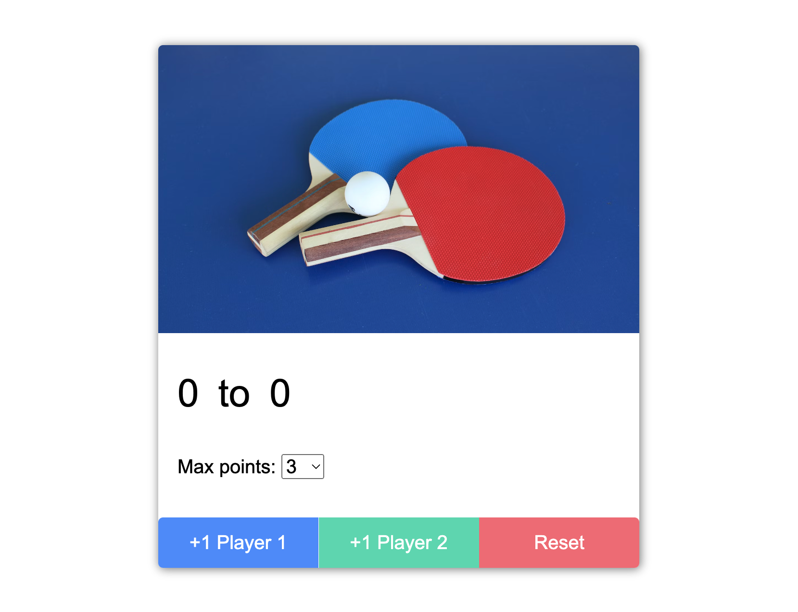

# Ping Pong Counter
Para este proyecto se pide que diseñéis una aplicación que lleve la cuenta de los puntos de cada jugador en una partida de ping pong. Al final del ejercicio tienes una imagen orientativa de cuál sería el resultado final (la imagen es orientativa, se admiten cambios estilísticos o aumentos en las funcionalidades).

## Descripción
Tendremos los siguientes elementos:
- `2` contadores que llevarán la cuenta de los puntos de cada jugador.
- `2` botones que servirán para aumentar cada contador.
- `1` select que establecerá los puntos máximos que puede alcanzar un jugador, y que finaliza la partida. Cuando uno de los jugadores alcance dicha puntación, los botones dejarán de funcionar por más que se les pulse. El select podrá establecerse a los siguientes valores: `3`(valor por defecto), `5`, `7`, `10`, `15`.
- `1` botón de `reset` que reiniciará la partida, poniendo los contadores a `0`.

## Iteraciones
Es importante que no tratemos de abordar los proyectos de golpe y sin planificación, sino que debemos tratar de ir resolviendo las tareas una a una. Por ello, deberéis ir construyendo la aplicación en las siguientes fases:

1. **MVP** (*Minimum Viable Product*  o Producto Mínimo Viable): lo primero que necesitamos cuando estamos construyendo una aplicación es tener cuanto antes una aplicación que cumpla con las tareas básicas. En este caso, lo mínimo es que los botones aumenten el contador de cada jugador en `1`.
2. Una vez logrado lo anterior, el siguiente paso será evitar que los contadores vayan más allá del valor establecido en el `select`. Para ello, considera la posibilidad de establecer una variable global en tu JS con el valor de dicho `select`, que sea evaluada por los eventos de los botones.
3. Logra que el select cambie esa variable.
4. Haz la funcionalidad del botón de reset.

